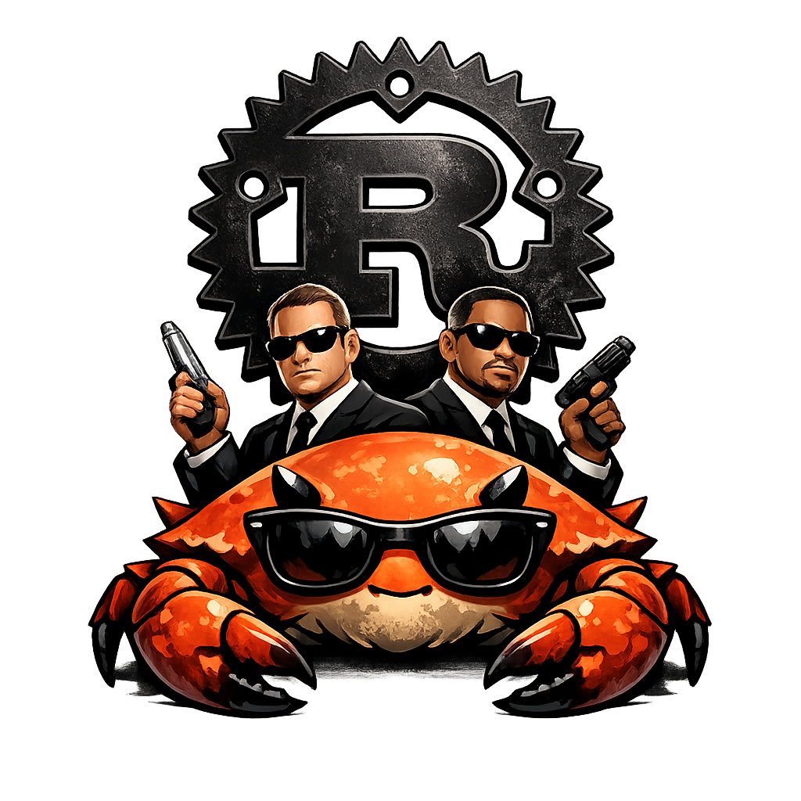

<p align="center">
  
</p>

# agents-rs

A minimal agent runtime in Rust. Three things:

- **Agents** — a trait that takes a `Context` and returns a `Response` (a message or tool calls).
- **Tools** — register callable tools; `run_with_tools` drives the tool-call loop.
- **Structured output** — parse the agent's final message into a typed value.

Enable the `llama-cpp` feature for a local-model `LocalAgent` backed by llama.cpp.

## Example

Drives a local GGUF model with one tool:

```sh
# CPU
cargo run --example calculator --features llama-cpp --release

# NVIDIA GPU
cargo run --example calculator --features cuda --release

# Apple Silicon
cargo run --example calculator --features metal --release
```

```rust
use agents_rs::{
    Context, FnTool, LocalAgent, LocalConfig, SchemaKind, ToolDefinition, ToolRegistry,
    run_with_tools,
};
use serde::{Deserialize, Serialize};

#[derive(Deserialize)]
struct AddArgs { a: i64, b: i64 }

#[derive(Serialize)]
struct AddResult { result: i64 }

#[tokio::main(flavor = "current_thread")]
async fn main() -> agents_rs::Result<()> {
    let def = ToolDefinition::builder("add", "Add two integers and return their sum.")
        .input(
            SchemaKind::object()
                .field("a", SchemaKind::integer())
                .field("b", SchemaKind::integer())
                .build(),
        )
        .build();
    let add = FnTool::new(def, |AddArgs { a, b }| async move {
        Ok(AddResult { result: a + b })
    });
    let registry = ToolRegistry::new().register(add);

    let agent = LocalAgent::from_config(
        LocalConfig::new("models/NVIDIA-Nemotron-3-Nano-4B-Q4_K_M.gguf"),
    )?
    .with_tools(&registry);

    let ctx = Context::new().with_user("What is 12 + 30? Use the add tool.");
    let out = run_with_tools(&agent, &registry, ctx, 4).await?;
    println!("{out}");
    Ok(())
}
```

## License

MIT
